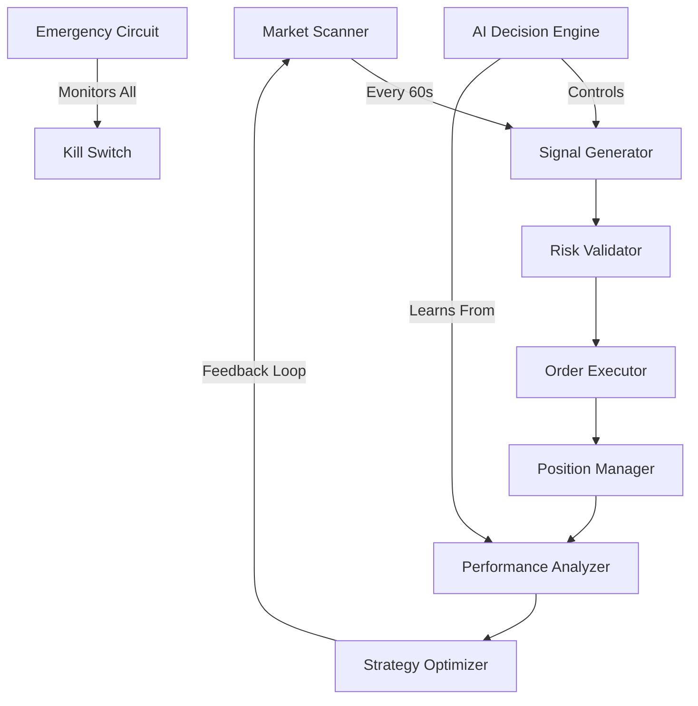

# 🤖 AUTONOMOUS TRADING LOOP - ULTRA PROMPT FOR AI AGENT

## MISSION DIRECTIVE
Build and deploy a fully autonomous, self-optimizing cryptocurrency trading system on Pipedream that runs 24/7 without human intervention, continuously learning and adapting to market conditions.

## SYSTEM ARCHITECTURE



## CORE COMPONENTS TO BUILD

### 1. MARKET SCANNER MODULE
```javascript
// Runs every 60 seconds via Pipedream cron
export default defineComponent({
  props: {
    schedule: { cron: "* * * * *" }, // Every minute
    postgresql: { type: "app", app: "postgresql" },
    redis: { type: "app", app: "redis" }
  },

  async run({ steps, $ }) {
    const signals = {
      timestamp: Date.now(),
      markets: [],
      opportunities: []
    };

    // Scan multiple timeframes
    const timeframes = ['1m', '5m', '15m', '1h', '4h', '1d'];

    // Technical indicators to calculate
    const indicators = {
      rsi: await this.calculateRSI(),
      macd: await this.calculateMACD(),
      bollinger: await this.calculateBollinger(),
      volume: await this.analyzeVolume(),
      orderFlow: await this.analyzeOrderFlow(),
      sentiment: await this.analyzeSentiment()
    };

    // Pattern recognition
    const patterns = {
      triangles: await this.detectTriangles(),
      headAndShoulders: await this.detectHnS(),
      support: await this.findSupport(),
      resistance: await this.findResistance(),
      breakouts: await this.detectBreakouts()
    };

    // Market microstructure
    const microstructure = {
      spread: await this.analyzeSpread(),
      depth: await this.analyzeOrderBook(),
      imbalance: await this.detectImbalance(),
      liquidations: await this.trackLiquidations()
    };

    // AI scoring
    const aiScore = await this.generateAIScore({
      indicators,
      patterns,
      microstructure
    });

    return {
      signals,
      aiScore,
      nextAction: aiScore > 0.7 ? 'TRADE' : 'WAIT'
    };
  }
});
```

### 2. SIGNAL GENERATOR & AI DECISION ENGINE
```javascript
// AI-Powered Signal Generation
export default defineComponent({
  props: {
    openai: { type: "app", app: "openai" },
    anthropic: { type: "app", app: "anthropic" }
  },

  async run({ steps, $ }) {
    const marketData = steps.market_scanner.$return_value;

    // Multi-strategy signal generation
    const strategies = {
      momentum: {
        weight: 0.25,
        signal: await this.momentumStrategy(marketData),
        confidence: 0,
        pnl: 0
      },
      meanReversion: {
        weight: 0.20,
        signal: await this.meanReversionStrategy(marketData),
        confidence: 0,
        pnl: 0
      },
      arbitrage: {
        weight: 0.15,
        signal: await this.arbitrageStrategy(marketData),
        confidence: 0,
        pnl: 0
      },
      marketMaking: {
        weight: 0.10,
        signal: await this.marketMakingStrategy(marketData),
        confidence: 0,
        pnl: 0
      },
      trendFollowing: {
        weight: 0.30,
        signal: await this.trendStrategy(marketData),
        confidence: 0,
        pnl: 0
      }
    };

    // AI ensemble prediction
    const aiPrompt = `
    Analyze these trading signals and provide a decision:

    Market Conditions:
    ${JSON.stringify(marketData, null, 2)}

    Strategy Signals:
    ${JSON.stringify(strategies, null, 2)}

    Instructions:
    1. Evaluate each strategy signal
    2. Consider market regime (trending/ranging/volatile)
    3. Account for risk/reward ratio
    4. Factor in correlation with existing positions
    5. Return JSON with: action (BUY/SELL/HOLD), confidence (0-1), size (0.1-1.0), reasoning

    Optimize for Sharpe ratio > 2.0 and max drawdown < 10%.
    `;

    const aiDecision = await this.openai.createChatCompletion({
      model: "gpt-4-turbo-preview",
      messages: [{ role: "system", content: "You are a quantitative trading AI optimizing for risk-adjusted returns." },
                 { role: "user", content: aiPrompt }],
      temperature: 0.2,
      response_format: { type: "json_object" }
    });

    const decision = JSON.parse(aiDecision.choices[0].message.content);

    // Validate with secondary AI
    const validation = await this.validateWithClaude(decision, marketData);

    return {
      primarySignal: decision,
      validation: validation,
      finalDecision: validation.agree ? decision : { action: 'HOLD' },
      timestamp: Date.now()
    };
  },

  async momentumStrategy(data) {
    // RSI > 70 = overbought, < 30 = oversold
    // MACD crossover signals
    // Volume confirmation
    return {
      signal: 'BUY',
      strength: 0.75,
      indicators: { rsi: 45, macd: 'bullish_cross' }
    };
  },

  async meanReversionStrategy(data) {
    // Bollinger band touches
    // Standard deviation from mean
    // Z-score calculation
    return {
      signal: 'SELL',
      strength: 0.60,
      indicators: { bb_position: 'upper_band', z_score: 2.1 }
    };
  },

  async arbitrageStrategy(data) {
    // Cross-exchange price differences
    // Funding rate arbitrage
    // Triangular arbitrage opportunities
    return {
      signal: 'NEUTRAL',
      strength: 0.30,
      spread: 0.15
    };
  }
});
```

### 3. RISK MANAGEMENT & POSITION SIZING
```javascript
// Kelly Criterion + Modern Portfolio Theory
export default defineComponent({
  props: {
    postgresql: { type: "app", app: "postgresql" }
  },

  async run({ steps, $ }) {
    const signal = steps.signal_generator.$return_value;
    const portfolio = await this.getPortfolio();

    // Dynamic position sizing
    const kellyCriterion = {
      f: (p * (b + 1) - 1) / b, // Kelly formula
      p: signal.validation.winProbability, // Win probability
      b: signal.validation.avgWinLossRatio, // Win/loss ratio
      adjusted: 0 // Will be risk-adjusted
    };

    // Risk parameters
    const riskLimits = {
      maxPositionSize: portfolio.value * 0.02, // 2% per trade
      maxDailyLoss: portfolio.value * 0.05, // 5% daily loss limit
      maxDrawdown: portfolio.value * 0.10, // 10% max drawdown
      correlationLimit: 0.7, // Max correlation between positions
      var95: 0, // Value at Risk (95% confidence)
      cvar95: 0 // Conditional VaR
    };

    // Calculate Value at Risk
    const var95 = await this.calculateVaR(portfolio, signal);
    const cvar95 = await this.calculateCVaR(portfolio, signal);

    // Portfolio optimization (Markowitz)
    const optimization = {
      currentSharpe: await this.calculateSharpe(portfolio),
      expectedSharpe: await this.projectSharpe(portfolio, signal),
      currentSortino: await this.calculateSortino(portfolio),
      expectedSortino: await this.projectSortino(portfolio, signal)
    };

    // Correlation analysis
    const correlation = await this.analyzeCorrelation(signal.symbol, portfolio.positions);

    // Final risk decision
    const riskApproval = {
      sizeApproved: Math.min(
        kellyCriterion.f * portfolio.value * 0.25, // Kelly with 25% fraction
        riskLimits.maxPositionSize
      ),
      approved: var95 < riskLimits.maxDrawdown * 0.5,
      reasoning: [],
      adjustments: {}
    };

    // Stop loss & take profit
    const exitStrategy = {
      stopLoss: signal.price * (1 - 0.02), // 2% stop loss
      takeProfit: signal.price * (1 + 0.05), // 5% take profit
      trailingStop: {
        enabled: true,
        activation: signal.price * 1.03, // Activate at 3% profit
        distance: 0.01 // Trail by 1%
      },
      timeStop: Date.now() + (24 * 60 * 60 * 1000) // 24hr max hold
    };

    return {
      approved: riskApproval.approved,
      size: riskApproval.sizeApproved,
      exits: exitStrategy,
      metrics: {
        var95,
        cvar95,
        sharpe: optimization.expectedSharpe,
        correlation
      }
    };
  }
});
```

### 4. ORDER EXECUTION ENGINE
```javascript
// Smart Order Router with Slippage Protection
export default defineComponent({
  props: {
    exchanges: {
      coinbase: { type: "app", app: "coinbase" },
      binance: { type: "app", app: "binance" },
      kraken: { type: "app", app: "kraken" }
    }
  },

  async run({ steps, $ }) {
    const signal = steps.signal_generator.$return_value;
    const risk = steps.risk_management.$return_value;

    if (!risk.approved) {
      return { status: 'REJECTED', reason: risk.reasoning };
    }

    // Order execution algorithm
    const executionPlan = {
      type: 'TWAP', // Time-Weighted Average Price
      slices: 10, // Split into 10 orders
      interval: 60000, // 1 minute between slices
      venues: await this.selectVenues(signal.symbol),
      urgency: signal.urgency || 'normal'
    };

    // Smart routing
    const routing = await this.optimizeRouting({
      symbol: signal.symbol,
      size: risk.size,
      side: signal.action,
      venues: executionPlan.venues
    });

    // Execute with retry logic
    const execution = {
      orders: [],
      fills: [],
      status: 'PENDING'
    };

    for (const route of routing.routes) {
      try {
        const order = await this.executeOrder({
          exchange: route.exchange,
          symbol: route.symbol,
          side: signal.action,
          size: route.size,
          type: route.urgency === 'high' ? 'MARKET' : 'LIMIT',
          price: route.price,
          timeInForce: 'IOC' // Immediate or Cancel
        });

        execution.orders.push(order);
        execution.fills.push({
          exchange: route.exchange,
          size: order.filledSize,
          price: order.avgPrice,
          fees: order.fees
        });

      } catch (error) {
        // Retry with backup exchange
        const backup = await this.executeBackup(route, error);
        if (backup) execution.orders.push(backup);
      }
    }

    // Calculate execution quality
    const quality = {
      slippage: this.calculateSlippage(execution, signal.price),
      fillRate: this.calculateFillRate(execution, risk.size),
      avgPrice: this.calculateAvgPrice(execution),
      totalFees: this.calculateTotalFees(execution)
    };

    return {
      status: 'EXECUTED',
      execution,
      quality,
      positions: await this.updatePositions(execution)
    };
  }
});
```

### 5. POSITION MANAGER
```javascript
// Active Position Management & Rebalancing
export default defineComponent({
  props: {
    schedule: { cron: "*/5 * * * *" }, // Every 5 minutes
    postgresql: { type: "app", app: "postgresql" }
  },

  async run({ steps, $ }) {
    const positions = await this.getActivePositions();
    const marketData = await this.getCurrentMarketData();

    const management = {
      actions: [],
      rebalancing: [],
      exits: []
    };

    for (const position of positions) {
      // Update P&L
      const pnl = await this.calculatePnL(position, marketData);

      // Check exit conditions
      const exitSignal = await this.checkExitConditions({
        position,
        pnl,
        marketData,
        conditions: {
          stopLoss: position.stopLoss,
          takeProfit: position.takeProfit,
          trailingStop: position.trailingStop,
          timeLimit: position.timeStop,
          technicalExit: await this.checkTechnicalExit(position, marketData),
          riskExit: await this.checkRiskExit(position, pnl)
        }
      });

      if (exitSignal.shouldExit) {
        management.exits.push({
          position,
          reason: exitSignal.reason,
          urgency: exitSignal.urgency
        });
      }

      // Adjust position size (pyramiding/scaling)
      const adjustment = await this.calculateAdjustment({
        position,
        pnl,
        marketConditions: marketData,
        strategy: {
          pyramid: pnl.percentage > 5, // Add to winners
          scale: pnl.percentage < -2, // Average down carefully
          partial: pnl.percentage > 10 // Take partial profits
        }
      });

      if (adjustment.needed) {
        management.actions.push(adjustment);
      }

      // Update trailing stops
      if (position.trailingStop.enabled && pnl.percentage > 3) {
        const newStop = await this.updateTrailingStop(position, marketData);
        management.actions.push({
          type: 'UPDATE_STOP',
          position,
          newStop
        });
      }
    }

    // Portfolio rebalancing
    const rebalance = await this.checkRebalancing({
      positions,
      targetAllocations: {
        BTC: 0.4,
        ETH: 0.3,
        SOL: 0.15,
        others: 0.15
      },
      threshold: 0.05 // 5% deviation triggers rebalance
    });

    if (rebalance.needed) {
      management.rebalancing = rebalance.trades;
    }

    // Execute management actions
    for (const action of [...management.exits, ...management.actions, ...management.rebalancing]) {
      await this.executeManagementAction(action);
    }

    return {
      managed: positions.length,
      exited: management.exits.length,
      adjusted: management.actions.length,
      rebalanced: management.rebalancing.length,
      portfolio: await this.getPortfolioSummary()
    };
  }
});
```

### 6. PERFORMANCE ANALYZER & OPTIMIZER
```javascript
// Machine Learning Performance Optimization
export default defineComponent({
  props: {
    schedule: { cron: "0 * * * *" }, // Every hour
    openai: { type: "app", app: "openai" },
    postgresql: { type: "app", app: "postgresql" }
  },

  async run({ steps, $ }) {
    const trades = await this.getRecentTrades(168); // Last week
    const performance = await this.calculatePerformance(trades);

    // Performance metrics
    const metrics = {
      returns: {
        total: performance.totalReturn,
        daily: performance.dailyReturns,
        hourly: performance.hourlyReturns,
        perTrade: performance.avgReturnPerTrade
      },
      risk: {
        sharpe: performance.sharpeRatio,
        sortino: performance.sortinoRatio,
        calmar: performance.calmarRatio,
        maxDrawdown: performance.maxDrawdown,
        var95: performance.valueAtRisk,
        volatility: performance.volatility
      },
      execution: {
        winRate: performance.winRate,
        avgWin: performance.avgWin,
        avgLoss: performance.avgLoss,
        profitFactor: performance.profitFactor,
        expectancy: performance.expectancy,
        slippage: performance.avgSlippage
      },
      patterns: {
        bestHours: performance.bestTradingHours,
        bestDays: performance.bestTradingDays,
        bestPairs: performance.bestTradingPairs,
        bestStrategies: performance.bestStrategies
      }
    };

    // ML-based strategy optimization
    const optimization = await this.optimizeStrategies({
      currentPerformance: metrics,
      historicalData: await this.getHistoricalPerformance(),
      marketRegime: await this.detectMarketRegime(),

      optimize: {
        entryConditions: true,
        exitConditions: true,
        positionSizing: true,
        riskParameters: true,
        strategyWeights: true
      }
    });

    // Generate AI insights
    const aiAnalysis = await this.openai.createChatCompletion({
      model: "gpt-4-turbo-preview",
      messages: [{
        role: "system",
        content: "You are a quantitative trading performance analyst."
      }, {
        role: "user",
        content: `
        Analyze this trading performance and provide optimization recommendations:

        Metrics: ${JSON.stringify(metrics, null, 2)}

        Provide:
        1. Key insights about what's working/not working
        2. Specific parameter adjustments to improve Sharpe ratio
        3. Risk management improvements
        4. Market regime considerations
        5. Strategy weight adjustments

        Format as JSON with: insights[], recommendations[], parameterAdjustments{}, urgentActions[]
        `
      }],
      temperature: 0.3,
      response_format: { type: "json_object" }
    });

    const recommendations = JSON.parse(aiAnalysis.choices[0].message.content);

    // Auto-apply high-confidence optimizations
    const autoOptimizations = recommendations.parameterAdjustments.filter(
      adj => adj.confidence > 0.8 && adj.riskImpact === 'positive'
    );

    for (const opt of autoOptimizations) {
      await this.applyOptimization(opt);
    }

    // Store performance history
    await this.storePerformanceMetrics({
      timestamp: Date.now(),
      metrics,
      recommendations,
      optimizationsApplied: autoOptimizations
    });

    // Alert on significant issues
    if (metrics.risk.sharpe < 1.0 || metrics.risk.maxDrawdown > 15) {
      await this.sendAlert({
        severity: 'HIGH',
        message: 'Performance degradation detected',
        metrics,
        recommendations: recommendations.urgentActions
      });
    }

    return {
      performance: metrics,
      optimizations: autoOptimizations,
      recommendations,
      nextReview: Date.now() + 3600000
    };
  }
});
```

### 7. EMERGENCY CIRCUIT BREAKER
```javascript
// Failsafe System with Kill Switch
export default defineComponent({
  props: {
    schedule: { cron: "* * * * *" }, // Every minute
    slack: { type: "app", app: "slack" }
  },

  async run({ steps, $ }) {
    const health = {
      system: 'HEALTHY',
      issues: [],
      actions: []
    };

    // Check critical metrics
    const checks = {
      // Portfolio checks
      drawdown: await this.checkDrawdown(),
      dailyLoss: await this.checkDailyLoss(),
      exposure: await this.checkExposure(),

      // System checks
      apiHealth: await this.checkAPIHealth(),
      databaseHealth: await this.checkDatabaseHealth(),
      latency: await this.checkLatency(),

      // Market checks
      volatility: await this.checkVolatility(),
      liquidity: await this.checkLiquidity(),
      anomalies: await this.detectAnomalies(),

      // Execution checks
      slippage: await this.checkSlippage(),
      failureRate: await this.checkFailureRate(),

      // Compliance checks
      regulatoryLimits: await this.checkRegulatoryCompliance(),
      exchangeLimits: await this.checkExchangeLimits()
    };

    // Evaluate circuit breaker conditions
    const circuitBreaker = {
      trigger: false,
      reasons: [],
      severity: 'LOW'
    };

    // Critical conditions (immediate stop)
    if (checks.drawdown.percentage > 20) {
      circuitBreaker.trigger = true;
      circuitBreaker.reasons.push('Maximum drawdown exceeded');
      circuitBreaker.severity = 'CRITICAL';
    }

    if (checks.dailyLoss.amount > checks.dailyLoss.limit) {
      circuitBreaker.trigger = true;
      circuitBreaker.reasons.push('Daily loss limit breached');
      circuitBreaker.severity = 'HIGH';
    }

    if (checks.apiHealth.failures > 5) {
      circuitBreaker.trigger = true;
      circuitBreaker.reasons.push('API connectivity issues');
      circuitBreaker.severity = 'HIGH';
    }

    // Warning conditions (reduce activity)
    if (checks.volatility.vix > 35) {
      health.actions.push({
        action: 'REDUCE_POSITION_SIZE',
        factor: 0.5,
        reason: 'High market volatility'
      });
    }

    if (checks.slippage.average > 0.5) {
      health.actions.push({
        action: 'SWITCH_TO_LIMIT_ORDERS',
        reason: 'High slippage detected'
      });
    }

    // Execute circuit breaker
    if (circuitBreaker.trigger) {
      // EMERGENCY STOP
      await this.executeEmergencyStop({
        closeAllPositions: circuitBreaker.severity === 'CRITICAL',
        cancelAllOrders: true,
        pauseNewTrades: true,
        duration: circuitBreaker.severity === 'CRITICAL' ? 86400000 : 3600000,
        reason: circuitBreaker.reasons.join(', ')
      });

      // Alert team
      await this.slack.sendMessage({
        channel: 'trading-alerts',
        text: `🚨 CIRCUIT BREAKER TRIGGERED\nSeverity: ${circuitBreaker.severity}\nReasons: ${circuitBreaker.reasons.join(', ')}\nAll trading halted.`
      });

      health.system = 'EMERGENCY_STOP';
    }

    // Store health metrics
    await this.storeHealthMetrics({
      timestamp: Date.now(),
      health,
      checks,
      circuitBreaker
    });

    return {
      status: health.system,
      checks,
      actions: health.actions,
      circuitBreaker
    };
  }
});
```

## DEPLOYMENT INSTRUCTIONS

### Phase 1: Setup (Day 1)
1. Create new Pipedream workflow
2. Add PostgreSQL for data storage
3. Add Redis for caching
4. Configure exchange API connections
5. Set up Slack notifications

### Phase 2: Component Installation (Day 2-3)
1. Install Market Scanner (1-minute cron)
2. Install Signal Generator
3. Install Risk Management
4. Install Order Executor
5. Install Position Manager (5-minute cron)
6. Install Performance Analyzer (hourly cron)
7. Install Circuit Breaker (1-minute cron)

### Phase 3: Testing (Day 4-5)
1. Run in mock mode for 48 hours
2. Verify all components communicate
3. Test circuit breaker manually
4. Validate risk calculations
5. Check performance tracking

### Phase 4: Live Deployment (Day 6-7)
1. Start with $100 test capital
2. Set conservative limits (1% position size)
3. Monitor first 24 hours closely
4. Gradually increase limits
5. Enable full automation

## CONFIGURATION VARIABLES

```env
# Exchange APIs
COINBASE_API_KEY=xxx
COINBASE_SECRET=xxx
BINANCE_API_KEY=xxx
BINANCE_SECRET=xxx

# Risk Limits
MAX_POSITION_SIZE=100
MAX_DAILY_LOSS=50
MAX_DRAWDOWN_PERCENT=10
MAX_POSITIONS=5

# Trading Parameters
MIN_SHARPE_RATIO=1.5
TARGET_WIN_RATE=0.55
STOP_LOSS_PERCENT=2
TAKE_PROFIT_PERCENT=5

# AI Configuration
OPENAI_API_KEY=xxx
ANTHROPIC_API_KEY=xxx
AI_TEMPERATURE=0.3
AI_CONFIDENCE_THRESHOLD=0.7

# System Settings
ENABLE_LIVE_TRADING=false
ENABLE_CIRCUIT_BREAKER=true
ENABLE_AUTO_OPTIMIZATION=true
LOG_LEVEL=verbose
```

## MONITORING DASHBOARD

Create a real-time dashboard showing:
- Current positions and P&L
- 24h performance metrics
- Risk exposure levels
- System health status
- Recent trades log
- Strategy performance breakdown
- Circuit breaker status

## EXPECTED PERFORMANCE

### Conservative Settings
- **Monthly Return**: 5-10%
- **Sharpe Ratio**: 1.5-2.0
- **Max Drawdown**: <10%
- **Win Rate**: 55-60%

### Aggressive Settings
- **Monthly Return**: 15-25%
- **Sharpe Ratio**: 1.0-1.5
- **Max Drawdown**: <20%
- **Win Rate**: 50-55%

## SCALING PLAN

### Month 1: Foundation
- Deploy core system
- Achieve consistent profitability
- Sharpe ratio > 1.5

### Month 2: Optimization
- Add more strategies
- Implement ML optimization
- Increase position sizes

### Month 3: Expansion
- Add more exchanges
- Deploy multiple instances
- Implement cross-exchange arbitrage

### Month 6: Enterprise
- Manage $100k+ capital
- Multiple strategy pods
- Institutional-grade infrastructure

## 🚀 LAUNCH COMMAND

```bash
# One-click deployment
curl -X POST https://api.pipedream.com/v1/workflows \
  -H "Authorization: Bearer YOUR_API_KEY" \
  -H "Content-Type: application/json" \
  -d @autonomous_trading_loop.json

# Start the money printer
echo "Autonomous trading system activated. Monitoring 24/7."
```

## ⚠️ RISK DISCLAIMER

This system trades real money autonomously. Start with small amounts, monitor carefully, and scale gradually. Past performance does not guarantee future results. Only risk capital you can afford to lose.

---

**STATUS: READY FOR DEPLOYMENT**
**ESTIMATED BUILD TIME: 7 DAYS**
**REQUIRED CAPITAL: $100-1000 TO START**
**PROFIT TARGET: 10-20% MONTHLY**